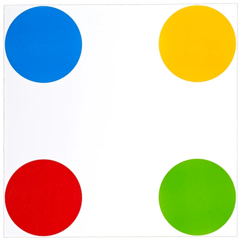

# 🐍 Snake Game

A modern take on the classic **Snake Game**, built entirely with **Python’s Turtle Graphics** module.
Eat food, grow your snake, and try to beat your high score — all in one window!



---

## 🎮 Features

* **Smooth Snake Movement** with arrow key control.
* **Dynamic Food Generation** at random positions.
* **Persistent High Score** stored in `data.txt`.
* **Automatic Restart** after collision with walls or self.
* **Simple UI** and fast rendering using the `turtle` module.

---

## 🧩 Project Structure

```
📁 SnakeGame
├── main.py           # Game loop and screen setup
├── snake.py          # Snake class: movement and body logic
├── food.py           # Food class: random position generator
├── scoreboard.py     # Score tracking and high score handling
├── data.txt          # Stores the highest score
├── img.jpg           # Game preview image
└── README.md         # Documentation file
```

---

## 🚀 How to Run

1. **Install Python 3.7+**
   Make sure you have Python installed. You can check with:

   ```bash
   python --version
   ```

2. **Clone the repository**

   ```bash
   git clone https://github.com/yourusername/snake_game.git
   cd snake_game
   ```

3. **Run the game**

   ```bash
   python main.py
   ```

4. **Controls**

   * ⬆️ **Up Arrow** – Move up
   * ⬇️ **Down Arrow** – Move down
   * ⬅️ **Left Arrow** – Move left
   * ➡️ **Right Arrow** – Move right

---

## 🧠 How It Works

* The **`Snake` class** controls the movement and direction logic.
* The **`Food` class** randomly places food items on the screen.
* The **`ScoreBoard` class** keeps track of your score and updates a persistent high score.
* The **`main.py`** file ties everything together and handles collisions and game resets.

---

## 🏆 Future Improvements

* Add sound effects and animations.
* Introduce levels or speed increase over time.
* Add a pause/resume feature.
* Create a main menu with difficulty settings.

---

## 🧑‍💻 Author

**Yossi Kaminski**
📍 Based in Israel
💬 Interested in coding, AI, and interactive games

---
